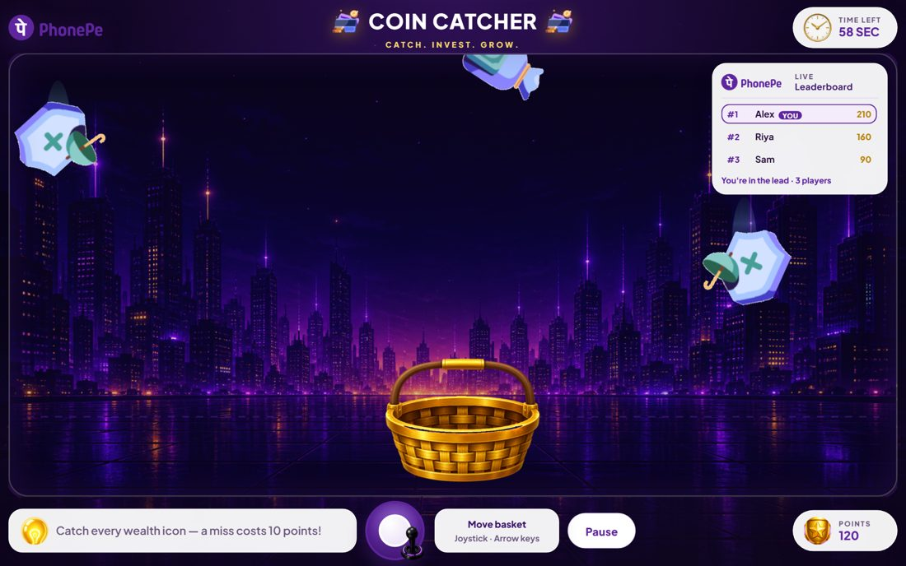

# Coin Catcher

PhonePe Precious Metals themed catcher game. Catch gold, silver, and platinum for 30 seconds, beat your best score, and climb the leaderboard.

**Play:** [https://coin-catcher.vercel.app](https://coin-catcher.vercel.app)

<p align="center">
  
</p>

<p align="center">
  
  
  
</p>

## Screens

| Home | How to play |
| --- | --- |
|  |  |

| In game | Leaderboard |
| --- | --- |
|  |  |

## How to play

1. Enter your name and press **Play**.
2. Move by dragging the playfield, or with A/D and arrow keys.
3. Catch Gold, Silver, and Platinum for **+10**.
4. A miss costs **−10**. The round does not end early.
5. Each new player gets a new leaderboard row, even if the name is already used. **Play again** updates that sitting only.

## Run locally

Open `index.html` in a browser, or serve the folder:

```bash
python -m http.server 4173
```

Then visit `http://localhost:4173`.

## Stack

HTML, CSS, and JavaScript. Scores are stored in the browser (`localStorage`).
